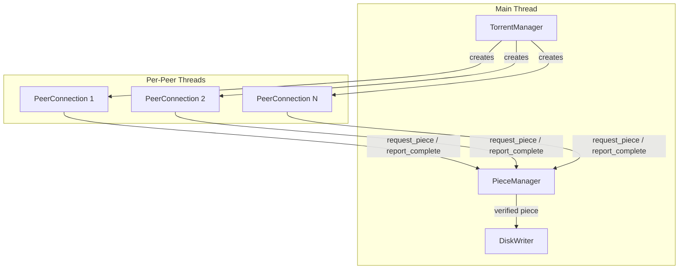
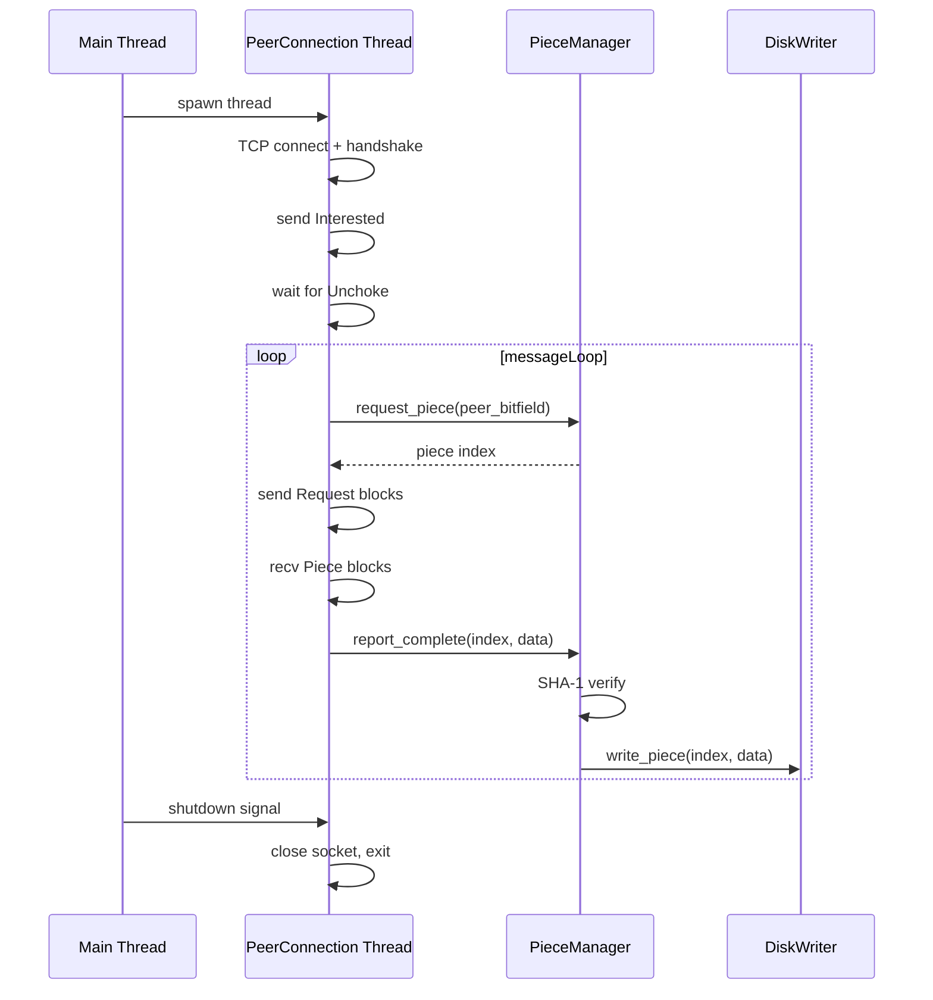

# Peer Wire Protocol -- Download (Leech) Design

## Architecture Overview




**Data flow:** `TorrentManager` spawns one `std::thread` per peer. Each `PeerConnection` thread runs its own message loop using an existing `TCPClientSocket`. It asks the shared `PieceManager` (mutex-protected) which piece to download next, fetches blocks via `request`/`piece` messages, reassembles the piece, SHA-1-verifies it, and hands verified data to `DiskWriter`.

---

## New Files


| File                                    | Purpose                                                                              |
| --------------------------------------- | ------------------------------------------------------------------------------------ |
| `inc/peer_wire/peer_message.h`          | Message types enum, serialization/deserialization of all 9 message types + handshake |
| `inc/peer_wire/peer_connection.h`       | One TCP connection to one peer: handshake, message loop, block I/O                   |
| `src/peer_wire/peer_connection.cpp`     | Implementation                                                                       |
| `inc/peer_wire/piece_manager.h`         | Thread-safe piece assignment, bitfield tracking, SHA-1 verification                  |
| `src/peer_wire/piece_manager.cpp`       | Implementation                                                                       |
| `inc/peer_wire/disk_writer.h`           | Maps piece+offset to file(s) on disk, writes verified data                           |
| `src/peer_wire/disk_writer.cpp`         | Implementation                                                                       |
| `inc/peer_wire/torrent_manager.h`       | Top-level orchestrator: tracker announce, spawn peers, progress, shutdown            |
| `src/peer_wire/torrent_manager.cpp`     | Implementation                                                                       |
| `tests/peer_wire/test_peer_message.cpp` | Unit tests for message serialization round-trips                                     |


---

## Component Details

### 1. `PeerMessage` -- Wire Protocol Layer

Location: [`inc/peer_wire/peer_message.h`]

Responsible for the binary format only; no networking.

```cpp
namespace peer_wire {

enum class MessageId : uint8_t {
    Choke         = 0,
    Unchoke       = 1,
    Interested    = 2,
    NotInterested = 3,
    Have          = 4,
    Bitfield      = 5,
    Request       = 6,
    Piece         = 7,
    Cancel        = 8,
};

struct Handshake {
    crypto::SHA1Hash info_hash;
    utils::PeerId    peer_id;

    std::vector<uint8_t> serialize() const;
    static Handshake deserialize(const uint8_t* buf, size_t len);
};

struct PeerMessage {
    MessageId id;
    std::vector<uint8_t> payload;  // empty for choke/unchoke/interested/not-interested

    std::vector<uint8_t> serialize() const;   // length-prefix + id + payload
    static PeerMessage deserialize(const uint8_t* buf, size_t len);
};

// Payload helpers
struct BlockRequest {       // used by Request and Cancel
    uint32_t index;
    uint32_t begin;
    uint32_t length;
};

struct BlockData {          // used by Piece message
    uint32_t index;
    uint32_t begin;
    std::vector<uint8_t> data;
};

} // namespace peer_wire
```

Uses existing `byte_order::write_be32` / `read_be32` from [`inc/byte_order.h`].

### 2. `PeerConnection` -- Per-Peer Thread

Location: [`inc/peer_wire/peer_connection.h`], [`src/peer_wire/peer_connection.cpp`]

Each instance owns a `TCPClientSocket` (from [`inc/net/socket.h`]) and runs in its own `std::thread`.

**Key state (per connection):**

```cpp
class PeerConnection {
    TCPClientSocket m_socket;
    Peer            m_peer;           // ip:port from tracker
    crypto::SHA1Hash m_info_hash;
    utils::PeerId   m_my_peer_id;

    // Choking / interest state -- 4 booleans
    bool m_am_choking    = true;   // I am choking the peer   (seeding prep)
    bool m_am_interested = false;  // I am interested in peer
    bool m_peer_choking  = true;   // Peer is choking me
    bool m_peer_interested = false;// Peer interested in me   (seeding prep)

    // What the remote peer has
    std::vector<bool> m_peer_bitfield;

    // Back-pointer (thread-safe, shared)
    PieceManager& m_piece_manager;

    // Current in-flight piece (if any)
    // ...
};
```

**Lifecycle (`run` method, executed on its thread):**

1. `TCPClientSocket::connect_with_timeout(peer, 5000)`
2. Send + receive **handshake** (68 bytes: `\x13BitTorrent protocol` + 8 reserved + info_hash + peer_id). Validate info_hash matches.
3. Optionally receive `Bitfield` message, store in `m_peer_bitfield`.
4. Send `Interested`.
5. **Message loop** (until shutdown flag or error):
  - Read 4-byte length prefix, then read that many bytes (message). Use `recv` / `recv_with_timeout`.
  - Dispatch by `MessageId`:
    - `Unchoke` -- set `m_peer_choking = false`, begin requesting blocks.
    - `Choke` -- set `m_peer_choking = true`, stop requesting.
    - `Have` -- update `m_peer_bitfield`.
    - `Piece` -- received a block; accumulate into current piece buffer. When all blocks for a piece arrive, pass to `PieceManager::report_complete`.
    - `Interested` / `NotInterested` -- update `m_peer_interested` (used later for seeding).
  - When unchoked and idle: ask `PieceManager::request_piece(m_peer_bitfield)` for next piece index; send `Request` messages for 16 KiB blocks.
6. On clean exit or error, close socket. Thread terminates.

**Seeding extension point:** When seeding is added, the message loop's `Request` handler will look up data from `DiskWriter::read_piece` and send `Piece` messages back. The `m_am_choking` / `m_peer_interested` flags are already in place for the choking algorithm.

### 3. `PieceManager` -- Shared Coordinator

Location: [`inc/peer_wire/piece_manager.h`], [`src/peer_wire/piece_manager.cpp`]

Thread-safe (all public methods lock a `std::mutex`). Shared among all `PeerConnection` threads.

```cpp
class PieceManager {
    std::mutex m_mutex;

    // From TorrentFile
    size_t   m_piece_count;
    uint64_t m_piece_size;
    uint64_t m_total_size;
    std::vector<crypto::SHA1Hash> m_piece_hashes;  // expected SHA-1 per piece

    // Piece states
    enum class PieceState { Missing, InProgress, Done };
    std::vector<PieceState> m_states;

    // Tracks which peers have which pieces (for rarest-first)
    std::vector<uint32_t> m_piece_availability;

    // Our bitfield (what we have) -- needed for seeding later
    std::vector<bool> m_have;

    DiskWriter& m_disk_writer;

public:
    // Called by PeerConnection threads
    std::optional<uint32_t> request_piece(const std::vector<bool>& peer_has);
    void release_piece(uint32_t index);  // peer disconnected before finishing
    bool report_complete(uint32_t index, const std::vector<uint8_t>& data);
    void update_availability(const std::vector<bool>& peer_bitfield, bool add);
    void mark_have(uint32_t index);  // called on incoming Have

    bool is_complete() const;
    std::vector<bool> get_our_bitfield() const;  // for seeding: send to new peers
    size_t pieces_remaining() const;
};
```

**Piece selection strategy:**

- `request_piece` picks from `Missing` pieces that the peer has.
- Initial phase: random selection (simple, avoids subset problem).
- After ~4 pieces acquired: rarest-first using `m_piece_availability`.
- Endgame mode: when all remaining pieces are `InProgress`, allow duplicate requests.

**SHA-1 verification** in `report_complete`: hash the received data with `crypto::sha1`, compare against `m_piece_hashes[index]`. If mismatch, reset state to `Missing` and return `false`. If match, call `m_disk_writer.write_piece(index, data)`, set state to `Done`, update `m_have`.

### 4. `DiskWriter` -- File I/O

Location: [`inc/peer_wire/disk_writer.h`], [`src/peer_wire/disk_writer.cpp`]

Maps piece indices to byte ranges within the torrent's file(s). Uses `TorrentFile::files` for multi-file torrents.

```cpp
class DiskWriter {
    std::string m_output_dir;
    uint64_t    m_piece_size;
    uint64_t    m_total_size;
    // File layout from TorrentFile (path + length per file)
    struct FileEntry { std::string path; uint64_t length; uint64_t offset; };
    std::vector<FileEntry> m_files;
    std::mutex m_mutex;

public:
    DiskWriter(const TorrentFile& torrent, const std::string& output_dir);

    void write_piece(uint32_t index, const std::vector<uint8_t>& data);

    // For future seeding: read a verified piece from disk
    std::vector<uint8_t> read_piece(uint32_t index);

    void preallocate_files();  // create files with correct sizes upfront
};
```

- `write_piece` computes `global_offset = index * piece_size`, finds which file(s) this spans, opens each file, seeks, writes. Protected by `m_mutex` (only verified pieces reach here, so contention is low).
- `read_piece` is the seeding counterpart -- reads from the same file layout.

### 5. `TorrentManager` -- Orchestrator

Location: [`inc/peer_wire/torrent_manager.h`], [`src/peer_wire/torrent_manager.cpp`]

This is the entry point. Called from `main()` or a future UI.

```cpp
class TorrentManager {
    std::unique_ptr<TorrentFile> m_torrent;
    utils::PeerId m_peer_id;

    PieceManager  m_piece_manager;
    DiskWriter    m_disk_writer;

    std::vector<std::thread> m_threads;
    std::vector<std::unique_ptr<PeerConnection>> m_connections;
    std::atomic<bool> m_shutdown{false};

public:
    TorrentManager(std::unique_ptr<TorrentFile> torrent,
                   const std::string& output_dir);

    void start();   // announce to tracker, spawn peer threads
    void stop();    // set shutdown flag, join threads, announce stopped

    bool is_complete() const;
    // Progress reporting
    double progress() const;  // pieces_done / piece_count
};
```

`**start()` flow:**

1. Generate `m_peer_id` via `utils::generate_peer_id()`.
2. Create tracker communicator via `create_communicator(tracker.protocol)`.
3. `announce(... EVENT_STARTED ...)` -- get peer list.
4. `m_disk_writer.preallocate_files()`.
5. For each peer (up to a cap, e.g., 30): create `PeerConnection`, spawn `std::thread` running `peer_connection->run()`.
6. Periodically re-announce (using tracker's interval) to discover new peers.
7. When `m_piece_manager.is_complete()`, announce `EVENT_COMPLETED`.

`**stop()` flow:**

1. Set `m_shutdown = true`.
2. Each `PeerConnection::run()` checks `m_shutdown` and exits its message loop.
3. `join()` all threads.
4. Announce `EVENT_STOPPED`.

---

## Seeding Extension Points

The design includes these hooks specifically for future seeding:

- `**m_am_choking` / `m_peer_interested`** in `PeerConnection` -- already tracked, unused during download-only. For seeding: implement the choking algorithm (unchoke top 4 uploaders + 1 optimistic unchoke every 30s).
- `**PeerConnection` handles incoming `Request` messages** -- during download-only, these are ignored. For seeding: look up data via `DiskWriter::read_piece()` and send `Piece` response.
- `**PieceManager::get_our_bitfield()`** -- returns what we have, so we can send `Bitfield` to newly connected peers.
- `**DiskWriter::read_piece()**` -- reads verified piece data from disk.
- `**TorrentManager` can accept incoming connections** -- add a `TCPServerSocket::listen()` path that creates `PeerConnection` objects for inbound peers (in addition to outbound connections).
- `**TorrentManager::start()` can transition to seeding mode** after download completes, keeping existing connections alive.

---

## Thread Safety Summary


| Resource                 | Protection                               | Accessed by                           |
| ------------------------ | ---------------------------------------- | ------------------------------------- |
| `PieceManager` internals | `std::mutex`                             | All peer threads + main               |
| `DiskWriter` file I/O    | `std::mutex`                             | Peer threads (via PieceManager)       |
| `m_shutdown`             | `std::atomic<bool>`                      | Main thread writes, peer threads read |
| `PeerConnection` state   | Thread-local (one thread per connection) | Own thread only                       |


---

## Concurrency Model




---

## Block Request Strategy

- Standard block size: **16 KiB** (2^14 bytes).
- Pipeline up to **5 outstanding requests** per peer to keep the connection busy.
- Last piece may be shorter; compute actual piece length as `min(piece_size, total_size - index * piece_size)`.
- Last block of a piece may be shorter than 16 KiB.

---

## Implementation Order

The components should be implemented in this sequence, each testable independently:

1. `**PeerMessage`** -- pure serialization, unit-testable with no network.
2. `**DiskWriter**` -- file I/O, testable with synthetic piece data.
3. `**PieceManager**` -- testable with mock piece data and fake SHA-1 hashes.
4. `**PeerConnection**` -- requires a real peer (integration test with a well-seeded torrent).
5. `**TorrentManager**` -- integration of all components.

